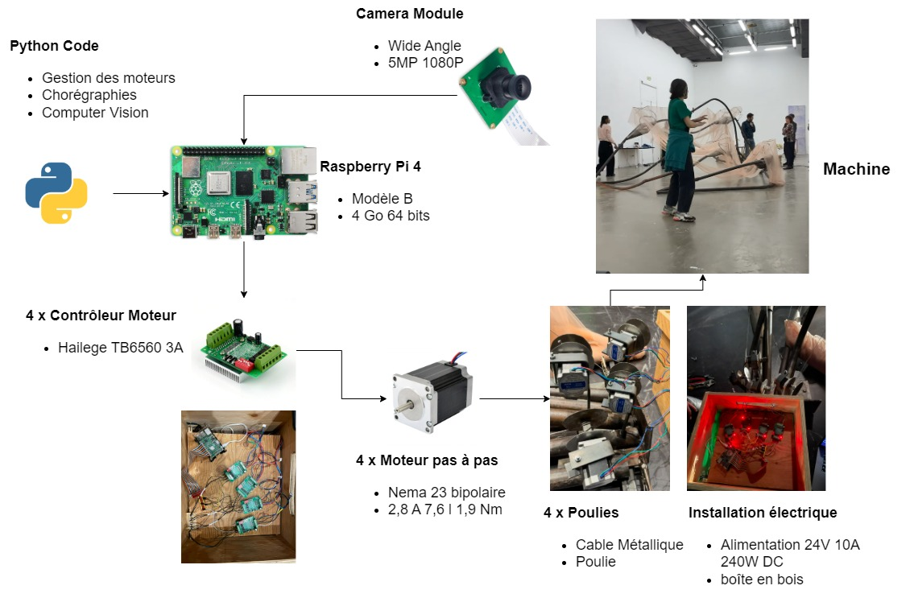

# The Machine

## Overview

This repo contains the code for an interactive art installation by [Lena Osseyran](https://www.lenaosseyran.com/) and [Chukri Soueidi](https://csoueidi.github.io/), created as part of a collaborative project. The installation features a metallic structure that mimics organic breathing forms and reacts dynamically to audience movements. The system leverages computer vision and predefined choreographies to create performances that engage and respond to viewers in real-time.

 ## System Architecture

The system architecture outlines the interaction between the audience, camera system, software modules, controllers, motor controllers, motors, and the mechanical structure.




*Figure 1: System Architecture of "The Machine" Installation*

  
### Hardware

- **Raspberry Pi 4 Model B (4GB)**: Primary controller running the computer vision and choreography modules.
- **Raspberry Pi 3**: Secondary controller managing the stepper motor control module.
- **Camera Module**: Detects audience movements using computer vision.
- **Motor Controllers**: Interfaces for controlling stepper motors.
- **Stepper Motors (Nema 23)**: Execute precise movements of the mechanical structure.
- **Power Supply**: 24V DC power supply dedicated to motor controllers.
- **Mechanical Structure**: Metallic, organic-looking framework with motorized appendages.


### Software

- **Python 3.7**: Programming language used for the project.
- **OpenCV**: Library for computer vision tasks.
- **NumPy**: Library for numerical computations.
- **Flask**: Web framework for hosting the choreography module.
- **SocketIO**: Real-time communication between the choreography module and the primary controller.
- **Antlr4**: Parser generator for the choreography language.

## Stepper Module

In our project, a central component is the precise control of stepper motors to animate the mechanical structure we built. The **Stepper** class is the cornerstone of this control system, designed to interface with stepper motors via a Raspberry Pi using Python. This class encapsulates all the functionalities required to operate the motors smoothly, manage their movements, and synchronize actions with other system components.

### Overview of the Stepper Class

The **Stepper** class serves as an abstraction layer between the hardware (stepper motors and GPIO pins) and the higher-level application logic. It manages the intricate details of motor control, such as stepping sequences, speed adjustments, direction changes, and position tracking, allowing us to focus on crafting the choreographies that bring our installation to life.

### Initialization and Configuration

When an instance of the **Stepper** class is created, it initializes several critical parameters:

- **GPIO Pins**: Sets up the GPIO pins connected to the motor's step, direction, and enable inputs.
- **Motor Specifications**: Accepts parameters like steps per revolution, which is essential for calculating movement increments.
- **Movement Constraints**: Defines maximum and minimum degrees of rotation to prevent mechanical overreach.
- **Direction Inversion**: Allows for inversion of motor direction to accommodate different wiring configurations.
- **Initial Positioning**: Sets the starting position of the motor, which can be loaded from a configuration file for consistency across sessions.

This initialization ensures that each motor is correctly configured according to its physical setup and ready for precise control.

### Task Management with Queues

To handle movement commands efficiently, the **Stepper** class uses a queue system for task management:

- **Enqueuing Tasks**: Movement commands are enqueued with specific degrees and speeds. This allows for asynchronous task execution without blocking the main program flow.
- **Dequeuing and Execution**: The class continuously checks for new tasks and executes them in order, ensuring smooth transitions between movements.

This queue-based system enables the motors to perform complex sequences of actions seamlessly, which is crucial for synchronizing movements in our choreographies.

### Speed and Movement Control

Controlling the speed and position of the motors is vital for achieving the desired motion effects. The **Stepper** class provides multiple methods for this purpose:

- **Speed Adjustments**: Allows setting speed in steps per second (sps), rotations per second (rps), or fractional rotations per second (frps), providing flexibility depending on the requirements.
- **Movement Commands**:
  - **Absolute Movement**: Moves the motor to a specific position based on a percentage of its maximum degree of rotation.
  - **Relative Movement**: Moves the motor by a certain number of degrees from its current position.
- **Direction Setting**: Adjusts the direction of rotation, which is particularly useful when the mechanical setup requires inversion due to gear arrangements or mounting.

These controls allow for precise and dynamic adjustments to motor movements, enabling the creation of intricate motion patterns.

#### Example: Implementing the `move` Method

Below is an implementation example of the `move` method within the `Stepper` class. This method handles absolute movement commands based on a percentage input, ensuring the motor moves within defined constraints and enqueues the movement task accordingly.

```python
def move(self, percentage, frps=None):
    # Check if percentage is between 0 and 1 (inclusive)
    if abs(percentage) > 1:
        percentage = 1
    elif percentage < 0:
        percentage = 0

    # Calculate the target degree based on the percentage
    target_degree = self.max_deg * percentage

    # Determine the speed to use
    if frps is not None:
        speed = frps
    else:
        speed = self.speed_sps / self.maxsteps

    # Determine the direction based on the percentage
    direction = percentage >= 0

    # Enqueue the movement task
    self.enqueue_item(target_degree, speed, direction)
```

**Explanation:**

1. **Input Validation:**
   - Ensures that the `percentage` parameter is clamped between `0` and `1`. This prevents the motor from attempting to move beyond its mechanical limits.

2. **Target Degree Calculation:**
   - Converts the percentage input into an absolute degree value (`self.max_deg * percentage`) to determine the exact position the motor should move to.

3. **Speed Determination:**
   - If a specific speed (`frps`) is provided, it uses that value.
   - Otherwise, it calculates the speed based on the default steps per second (`self.speed_sps`) divided by the maximum number of steps (`self.maxsteps`).

4. **Direction Setting:**
   - Determines the direction of movement based on whether the percentage is positive or negative.

5. **Task Enqueuing:**
   - Adds the movement task to the queue using the `enqueue_item` method, which manages the execution of motor movements asynchronously.

This method encapsulates the logic required to handle movement commands efficiently, ensuring that all inputs are validated and that the motor operates within its defined parameters.

### Position Tracking and Synchronization

Accurate position tracking is essential for synchronizing multiple motors and ensuring that movements are executed as planned:

- **Position Retrieval**: Methods are available to get the current position in steps, degrees, or radians, facilitating easy integration with various calculation needs.
- **Target Tracking**: The class continuously tracks the target position and moves the motor accordingly, stepping incrementally towards the desired position.
- **Synchronization**: By managing the positions and movements through the queue system, multiple motors can be synchronized to move in unison or in carefully timed sequences.

This capability is crucial for our project, where coordinated movements create the visual and kinetic effects of the installation.

### Threading and Asynchronous Execution

The **Stepper** class employs threading to manage motor control without hindering the main application:

- **Timer Thread**: A separate thread runs a callback function that handles the execution of movement tasks and position tracking.
- **Non-Blocking Operations**: This design ensures that motor control does not block other processes, such as user input handling or sensor data processing.
- **Safe Shutdown**: Methods are provided to stop the motor and clean up the thread safely, ensuring that resources are properly released.

Using threading allows the system to remain responsive and efficient, even when executing complex movement sequences.

### Integration with Configuration Management

To maintain consistency and ease of configuration, the **Stepper** class integrates with a configuration management system:

- **Loading Configurations**: Motor settings such as pin assignments, speed parameters, and initial positions are loaded from a configuration file.
- **Saving State**: The current position of the motor can be saved back to the configuration, allowing the system to resume from the last known state after a restart.
- **Dynamic Updates**: Configuration methods enable updating motor parameters on the fly, providing flexibility during testing and calibration.

This integration simplifies the setup process and ensures that motor configurations are centralized and easily maintainable.

### Error Handling and Safety Features

Safety is paramount when dealing with mechanical movements:

- **Boundary Checks**: The class includes checks to prevent the motor from moving beyond its defined maximum and minimum degrees of rotation, protecting the mechanical structure from damage.
- **Input Validation**: Movement commands are validated to ensure they are within acceptable ranges, providing robustness against erroneous inputs.
- **Emergency Stop**: Methods are available to immediately halt motor movements in case of an emergency or unexpected behavior.

By incorporating these features, we ensure that the system operates reliably and safely.

### Practical Usage in the Project

In the context of our project, the **Stepper** class allows us to:

- **Create Choreographies**: By enqueuing movement tasks with precise timings, we can choreograph complex motion sequences that bring our installation to life.
- **Respond to Interactions**: The motors can be controlled in response to sensor inputs, such as moving when someone approaches, enhancing the interactive experience.
- **Modular Design**: Each motor is controlled by its own instance of the **Stepper** class, allowing for modular and scalable designs.

This flexibility and control are essential for achieving the artistic vision of our project while maintaining technical excellence.

### Conclusion

The **Stepper** class is a critical component that bridges the gap between software control and mechanical motion in our project. By providing a comprehensive and flexible interface for motor control, it enables us to create intricate and synchronized movements that are both technically precise and artistically expressive. Its design considers the practical needs of motor control, such as threading for asynchronous execution, configuration management for ease of use, and safety features to protect the hardware. Through this class, we achieve a harmonious blend of art and technology, showcasing the power of interdisciplinary collaboration.

## The Choreography Module

To control the movements of the stepper motors in our mechanical installation, we developed a custom **Choreography Language**. This language allows us to script complex motor sequences in a clear and precise manner, facilitating synchronized movements and intricate patterns without dealing with low-level motor control code. This allows us to focus on the artistic expression of the installation while maintaining full control over the mechanical elements.

### Purpose and Design Goals

- **Simplify Motor Control**: Provide a straightforward syntax to define motor actions.
- **Enable Synchronization**: Allow multiple motors to move together or in coordinated sequences.
- **Support Complex Sequences**: Include constructs like loops, timing controls, and speed adjustments.
- **Enhance Readability**: Make scripts easy to read and maintain.
- **User-Friendly Interface**: Offer an accessible way for users to create, edit, and execute choreographies.

### Understanding the Language

#### Representation of Movement

In our Choreography Language, motor movements are defined by the **percentage of the arm's opening**. A value of `0` represents the arm fully closed, while `1` indicates the arm fully open. This abstraction allows us to specify positions in a way that is intuitive and independent of the physical characteristics of the motors. Another key aspect of the language is the ability to control the speed of movements, providing flexibility in the execution of sequences.

#### Core Commands

1. **Move Command**

   Instructs a motor or all motors to move to a specified position based on the percentage of arm opening.

   - **Syntax**: `move(motor_id, percentage, speed);`

     - `motor_id`: The identifier of the motor (e.g., `1`, `2`, or `all` for all motors).
     - `percentage`: The target position as a fraction between `0` and `1`; represents the percentage of how much the mechanical arm will open.
     - `speed` (optional): The speed of the movement, in fractional rotations per second (FRPS).

   - **Examples**:
     - `move(1, 0.5);` moves motor 1 to 50% open at the current default speed.
     - `move(2, 0.75, 0.3);` moves motor 2 to 75% open at 0.3 FRPS.
     - `move(all, 1);` moves all motors to fully open.

2. **Sync Command**

   Executes multiple move commands simultaneously, ensuring that all included movements start at the same time and waits for all to complete before proceeding to the next command.

   - **Syntax**:

     ```
     sync {
         move commands
     }
     ```

   - **Example**:
     ```
     sync {
         move(1, 0.9);
         move(2, 0.9);
         move(3, 0.9);
         move(4, 0.9);
     }
     ```
     All four motors begin moving to 90% open at the same time.

3. **Repeat Command**

   Repeats a set of commands a specified number of times.

   - **Syntax**:

     ```
     repeat times {
         commands
     }
     ```

     - `times`: The number of times to repeat the enclosed commands.

   - **Example**:
     ```
     repeat 3 {
         move(1, 0);
         move(1, 1);
     }
     ```
     Motor 1 alternates between fully closed and fully open three times.

4. **Set Speed Command (`set_frps`)**

   Sets the default speed for subsequent move commands.

   - **Syntax**: `set_frps speed;`

     - `speed`: The speed in fractional rotations per second.

   - **Example**: `set_frps 0.5;` sets the default speed to 0.5 FRPS.

5. **Wait Command**

   Pauses execution for a specified number of seconds.

   - **Syntax**: `wait(seconds);`

     - `seconds`: The duration to wait.

   - **Example**: `wait(2);` pauses execution for 2 seconds.

### How the Language Works

#### Defining Movement Sequences

The Choreography Language allows us to script sequences by combining the core commands:

- **Sequential Execution**: Commands are executed in the order they appear unless modified by `sync` or `repeat`.
- **Default Speed**: Movements use the current default speed set by `set_frps`, unless a specific speed is provided in the command.
- **Motor Identification**: Motors are referenced by their IDs, enabling control of individual motors or all motors collectively.

#### Synchronization and Timing

- **Synchronization with `sync`**: Ensures that all move commands within the block start simultaneously and complete before moving to the next command.
- **Repetition with `repeat`**: Automates repetitive movement patterns efficiently.
- **Timing with `wait`**: Controls the pacing of sequences, allowing for precise timing between actions.

### Practical Examples

#### Example 1: Basic Movement Sequence

```plaintext
set_frps 0.2;

move(1, 0.5);
move(2, 0.5);
move(3, 0.5);
move(4, 0.5);
```

- Sets the default speed to 0.2 FRPS.
- Sequentially moves each motor to 50% open.

#### Example 2: Synchronized Movement

```plaintext
set_frps 0.5;

sync {
    move(all, 1);
}
```

- Sets the default speed to 0.5 FRPS.
- All motors move to fully open simultaneously.

#### Example 3: Repeated Movements with Pauses

```plaintext
repeat 2 {
    move(1, 0);
    wait(1);
    move(1, 1);
    wait(1);
}
```

- Repeats the sequence twice:
  - Motor 1 moves to fully closed.
  - Waits for 1 second.
  - Motor 1 moves to fully open.
  - Waits for 1 second.

#### Example 4: Complex Sequence

```plaintext
set_frps 0.3;

sync {
    move(1, 0.25);
    move(2, 0.25);
}

wait(0.5);

sync {
    move(3, 0.75);
    move(4, 0.75);
}

repeat 3 {
    move(1, 0);
    move(2, 0);
    wait(0.2);
    move(1, 0.25);
    move(2, 0.25);
    wait(0.2);
}
```

- Sets the default speed to 0.3 FRPS.
- Synchronously moves motors 1 and 2 to 25% open.
- Waits for half a second.
- Synchronously moves motors 3 and 4 to 75% open.
- Repeats a sequence three times where motors 1 and 2 oscillate between fully closed and 25% open with short waits.

### Execution Framework Overview

#### High-Level Process

1. **Script Loading**: The choreography script is loaded into the system.
2. **Command Interpretation**: Each command is parsed and interpreted in sequence.
3. **Motor Control**: Commands are translated into actions performed by the motors.
   - **Move Commands**: The motors are instructed to move to the specified percentage of opening.
   - **Sync Blocks**: The framework ensures that all move commands within a sync block start at the same time and waits for their completion.
   - **Repeat Blocks**: The enclosed commands are executed multiple times as specified.
   - **Wait Commands**: Introduce precise delays between actions.

#### Motor Interaction

- **Motor Instances**: Each motor is represented by an instance of the `Stepper` class, which handles low-level motor control.
- **Command Execution**: The execution framework calls methods on these motor instances to perform movements.
- **Synchronization**: The framework manages the timing to synchronize movements across multiple motors.

### User Interface Integration

To facilitate easy creation, editing, and execution of choreography scripts, we developed a web-based **HTML User Interface**. This interface allows users to manage choreography files directly from a browser, enhancing accessibility and streamlining the workflow.

#### Key Features

- **File Management**: Users can create new choreography files, load existing ones, and delete obsolete scripts.
- **Script Editing**: An integrated text editor enables users to write and modify choreography scripts within the browser.
- **Execution Control**: Users can execute the currently loaded script and stop execution if necessary.
- **Real-Time Feedback**: A log section displays execution status and system messages, providing immediate feedback.


### Advantages of the Choreography Language and Interface

- **Simplifies Complex Control**: Allows us to define intricate movement sequences without dealing with low-level motor commands.
- **Enhances Readability**: The syntax is clear and descriptive, making scripts easy to understand and modify.
- **Facilitates Collaboration**: Team members with different expertise can read, write, and manage scripts effectively using the interface.
- **Increases Flexibility**: Adjustments to movement sequences can be made quickly by editing the script through the interface.
- **Streamlines Workflow**: The integrated interface consolidates scripting and execution, improving efficiency.

### Use Cases in the Project

- **Performance Programming**: Designing and adjusting sequences for the installation during rehearsals and performances.
- **Interactive Responses**: Creating scripts that respond to sensor inputs, such as moving when someone approaches.
- **Testing and Calibration**: Running specific movements to test motor functionality or calibrate positions.

### Conclusion

The Choreography Language, combined with the execution framework and user interface, provides a powerful and flexible toolset for controlling the stepper motors in our mechanical installation. By abstracting motor movements into percentage-based positions and providing intuitive commands for synchronization and timing, we can create complex, coordinated sequences that enhance the artistic expression of the installation. The web-based interface further simplifies the process, making it accessible and efficient for the entire team.


